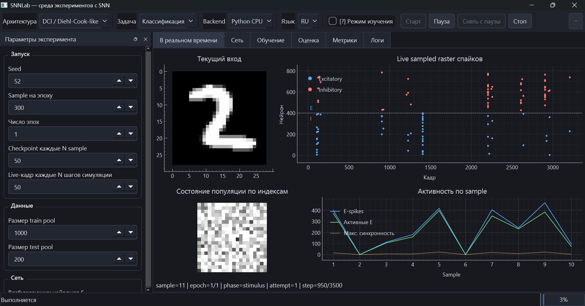

# SNNLab 1.0

[English](README.md) | [Русский](README_RU.md)

SNNLab — исследовательский Python-фреймворк и desktop-среда для экспериментов со спайковыми нейронными сетями. Сейчас в проекте есть две рабочие архитектуры, визуализация в реальном времени, воспроизводимые конфигурации экспериментов, продолжение обучения из checkpoint и интерфейс на русском и английском языках.



## Что входит в текущую версию

- **DCI / Diehl–Cook-like SNN**: возбуждающая и тормозная популяции нейронов Ижикевича, STDP для Input→E, латеральное торможение, target-rate гомеостаз, receptive fields и классификация средствами самой SNN.
- **Reservoir / LSM-like SNN**: фиксированные рекуррентные веса, выбор численного метода, живая визуализация спайков и readout для reservoir-computing экспериментов.
- Семь методов численного интегрирования нейронов Ижикевича.
- Текущий вход, raster plot, состояние популяции, история активности, receptive fields, evaluation-диагностика и интерактивные значения на графиках.
- Пауза, остановка, загрузка checkpoint, точное продолжение и дообучение.
- Переключение RU/EN и режим изучения с пояснениями параметров.
- YAML-конфигурации, логи, метрики и метаданные для воспроизводимости.

## Требования

- Рекомендуется 64-битный Python **3.11 или 3.12**.
- Основная проверенная платформа — Windows 10/11. На Linux нужен совместимый Qt-графический стек.
- При первом использовании MNIST потребуется интернет для загрузки набора данных.

## Варианты установки

### Вариант 1 — установка готового wheel

Это самый простой вариант для коллег, которым нужно только запустить SNNLab. Wheel содержит упакованный код проекта; `pip` устанавливает его в Python-окружение и создаёт команду `snnlab-gui`.

Создай и активируй виртуальное окружение:

```powershell
py -3.11 -m venv .venv
.\.venv\Scripts\Activate.ps1
python -m pip install --upgrade pip
```

Находясь в папке с wheel, установи его вместе с GUI и поддержкой MNIST:

```powershell
python -m pip install "./snnlab-1.0.0-py3-none-any.whl[gui,mnist]"
snnlab-gui
```

Wheel не является самостоятельным `.exe`: Python всё равно нужен. PySide6, pyqtgraph и TensorFlow загрузит `pip`.

### Вариант 2 — обычная установка из Git-репозитория

Подходит, когда проект клонирован из Git или скачан ZIP-архивом, но редактировать сам пакет не планируется:

```powershell
cd SNNLab
py -3.11 -m venv .venv
.\.venv\Scripts\Activate.ps1
python -m pip install --upgrade pip
python -m pip install ".[gui,mnist]"
snnlab-gui
```

В окружение будет установлена фиксированная копия текущего исходного кода.

### Вариант 3 — editable-установка для разработки

Используй её, если собираешься менять код. Изменения в рабочей папке будут подхватываться без повторной сборки wheel:

```powershell
cd SNNLab
py -3.11 -m venv .venv
.\.venv\Scripts\Activate.ps1
python -m pip install --upgrade pip
python -m pip install -e ".[gui,mnist,dev]"
python -m pytest
snnlab-gui
```

### Вариант 4 — минимальная установка ядра

Для использования кода без GUI и без загрузчика MNIST:

```powershell
python -m pip install .
```

или из wheel:

```powershell
python -m pip install ./snnlab-1.0.0-py3-none-any.whl
```

Так будут установлены ядро SNNLab, NumPy, scikit-learn и PyYAML. Для GUI и MNIST нужны extras `gui` и `mnist`.

## Быстрый запуск

Запуск desktop-интерфейса:

```powershell
snnlab-gui
```

Доступные CLI-команды:

```powershell
snnlab-dci --help
snnlab-reservoir --help
snnlab-dci-regression --help
```

Готовые конфигурации экспериментов лежат в папке `examples/`. Их можно импортировать через меню конфигурации в GUI.

## Checkpoint и дообучение

Checkpoint сохраняет веса модели, динамическое состояние сети, позицию обучения, расписание sample и состояние генератора случайных чисел. После загрузки собственного checkpoint модель можно оценивать или продолжать обучать.

Внутри checkpoint используется Python pickle. Не загружай checkpoint из недоверенных источников.

## Результаты экспериментов

GUI сохраняет запуски в `runs/gui/`. В папке конкретного запуска могут находиться конфигурация, логи, метрики, checkpoint, model snapshot и сведения о протоколе данных.

Папки `runs/`, `.venv/`, `build/` и `dist/` не нужно добавлять в Git.

## Текущие ограничения

- Только Python CPU backend.
- Классификация DCI сейчас демонстрируется на MNIST.
- Reservoir имеет собственные средства анализа и evaluation readout.
- Дополнительные модели нейронов, визуальный конструктор произвольных сетей, C++, CUDA и удалённый запуск относятся к дальнейшему развитию проекта.

## Структура репозитория

```text
SNNLab/
├── snnlab/          # код фреймворка и GUI
├── tests/           # автоматические тесты
├── examples/        # примеры конфигураций
├── docs/assets/     # изображения для README
├── README.md
├── README_RU.md
├── LICENSE
└── pyproject.toml
```

## Лицензия

SNNLab распространяется по лицензии MIT. Полный текст находится в [LICENSE](LICENSE).
